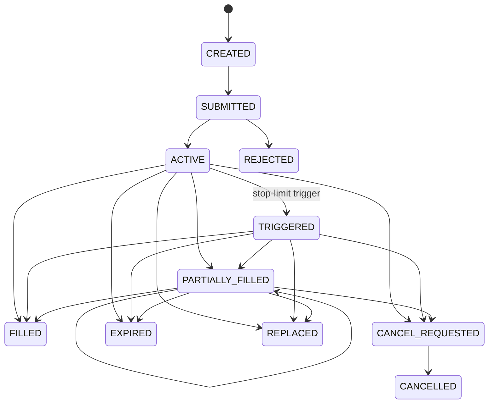

# Order State Transitions

Terminal states are `FILLED`, `REJECTED`, `CANCELLED`, `EXPIRED`, and `REPLACED`. A transition is an
immutable event; no order record is updated in place. Replacement creates a new order identity and
links both records. A stop-limit trigger cannot fill on its trigger bar under
`CONSERVATIVE_OHLC_1M_V1`. DAY expiry is evaluated at the verified session boundary. IOC cancels its
unfilled remainder after its first eligible event. GTC remains active until a terminal event or the
run's explicit end policy. Any transition absent from this graph fails closed.

Transition ordering at one timestamp is data/session facts, settlements, finalized market event,
strategy action, risk decision, order transition/fill, accounting, then post-event risk. Stable IDs
break ties; collection iteration order never does.
